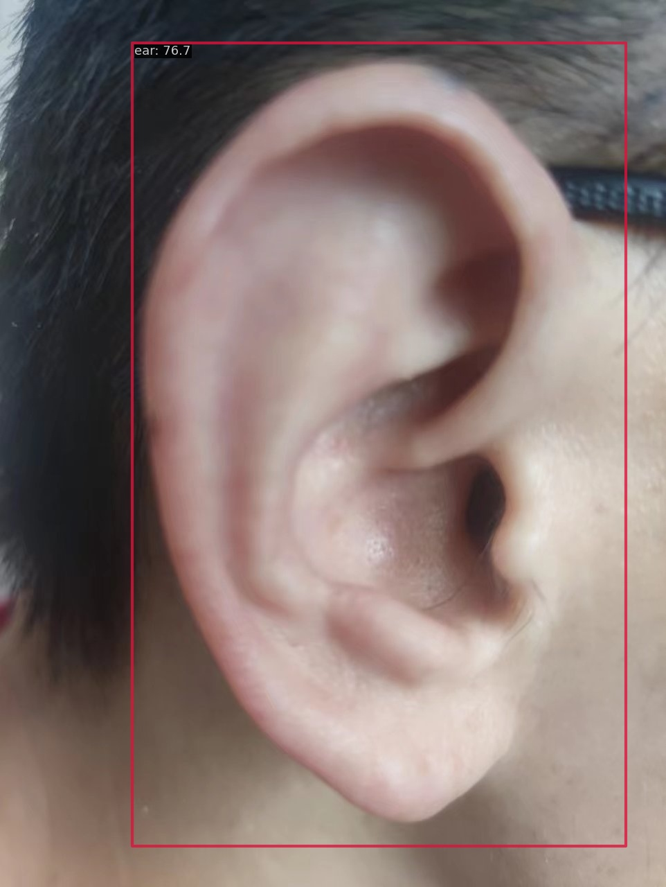
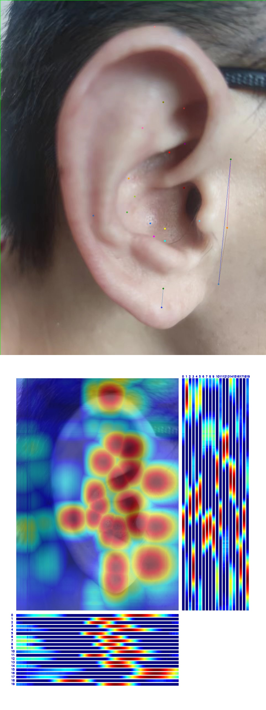

# openmmlab-learning

Task 1 https://github.com/open-mmlab/OpenMMLabCamp/issues/85

## mmdet test log

```
# python tools/test.py rtmdet_tiny_ear.py  work_dirs/rtmdet_tiny_ear/best_coco_bbox_mAP_epoch_170.pth

 Average Precision  (AP) @[ IoU=0.50:0.95 | area=   all | maxDets=100 ] = 0.817
 Average Precision  (AP) @[ IoU=0.50      | area=   all | maxDets=100 ] = 0.966
 Average Precision  (AP) @[ IoU=0.75      | area=   all | maxDets=100 ] = 0.966
 Average Precision  (AP) @[ IoU=0.50:0.95 | area= small | maxDets=100 ] = -1.000
 Average Precision  (AP) @[ IoU=0.50:0.95 | area=medium | maxDets=100 ] = -1.000
 Average Precision  (AP) @[ IoU=0.50:0.95 | area= large | maxDets=100 ] = 0.817
 Average Recall     (AR) @[ IoU=0.50:0.95 | area=   all | maxDets=  1 ] = 0.855
 Average Recall     (AR) @[ IoU=0.50:0.95 | area=   all | maxDets= 10 ] = 0.855
 Average Recall     (AR) @[ IoU=0.50:0.95 | area=   all | maxDets=100 ] = 0.855
 Average Recall     (AR) @[ IoU=0.50:0.95 | area= small | maxDets=100 ] = -1.000
 Average Recall     (AR) @[ IoU=0.50:0.95 | area=medium | maxDets=100 ] = -1.000
 Average Recall     (AR) @[ IoU=0.50:0.95 | area= large | maxDets=100 ] = 0.855
06/04 00:27:22 - mmengine - INFO - bbox_mAP_copypaste: 0.817 0.966 0.966 -1.000 -1.000 0.817
06/04 00:27:22 - mmengine - INFO - Epoch(test) [11/11]    coco/bbox_mAP: 0.8170  coco/bbox_mAP_50: 0.9660  coco/bbox_mAP_75: 0.9660  coco/bbox_mAP_s: -1.0000  coco/bbox_mAP_m: -1.0000  coco/bbox_mAP_l: 0.8170  data_time: 0.2005  time: 0.3543

```

使用自己的耳朵预测



## mmpose test log

```
# python tools/test.py rtmpose-s-ear.py  work_dirs/rtmpose-s-ear/best_PCK_epoch_300.pth
 Average Precision  (AP) @[ IoU=0.50:0.95 | area=   all | maxDets= 20 ] =  0.761
 Average Precision  (AP) @[ IoU=0.50      | area=   all | maxDets= 20 ] =  1.000
 Average Precision  (AP) @[ IoU=0.75      | area=   all | maxDets= 20 ] =  0.945
 Average Precision  (AP) @[ IoU=0.50:0.95 | area=medium | maxDets= 20 ] = -1.000
 Average Precision  (AP) @[ IoU=0.50:0.95 | area= large | maxDets= 20 ] =  0.761
 Average Recall     (AR) @[ IoU=0.50:0.95 | area=   all | maxDets= 20 ] =  0.781
 Average Recall     (AR) @[ IoU=0.50      | area=   all | maxDets= 20 ] =  1.000
 Average Recall     (AR) @[ IoU=0.75      | area=   all | maxDets= 20 ] =  0.952
 Average Recall     (AR) @[ IoU=0.50:0.95 | area=medium | maxDets= 20 ] = -1.000
 Average Recall     (AR) @[ IoU=0.50:0.95 | area= large | maxDets= 20 ] =  0.781
06/04 00:24:15 - mmengine - INFO - Evaluating PCKAccuracy (normalized by ``"bbox_size"``)...
06/04 00:24:15 - mmengine - INFO - Evaluating AUC...
06/04 00:24:15 - mmengine - INFO - Evaluating NME...
06/04 00:24:15 - mmengine - INFO - Epoch(test) [6/6]    coco/AP: 0.761312  coco/AP .5: 1.000000  coco/AP .75: 0.945091  coco/AP (M): -1.000000  coco/AP (L): 0.761312  coco/AR: 0.780952  coco/AR .5: 1.000000  coco/AR .75: 0.952381  coco/AR (M): -1.000000  coco/AR (L): 0.780952  PCK: 0.978458  AUC: 0.115533  NME: 0.041582  data_time: 0.801522  time: 1.052411
```

使用自己的耳朵预测


