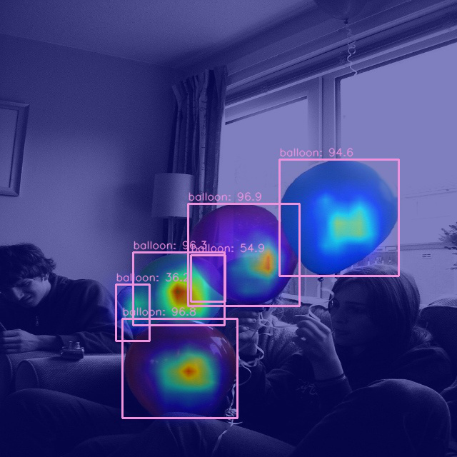
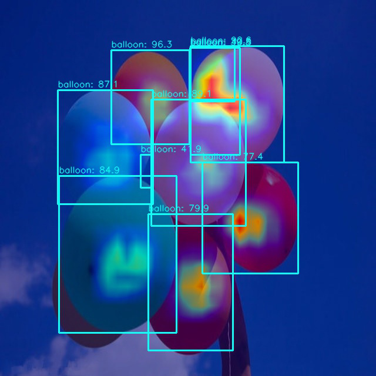

# openmmlab-learning

## Train

```
06/11 03:36:14 - mmengine - INFO - Exp name: rtmdet_tiny_1xb12-40e_balloon_20230611_033352
06/11 03:36:16 - mmengine - INFO - Epoch(train) [40][5/6]  lr: 9.4971e-06  eta: 0:00:00  time: 0.4077  data_time: 0.1527  memory: 1535  loss: 0.6198  loss_cls: 0.4284  loss_bbox: 0.1914
06/11 03:36:16 - mmengine - INFO - Exp name: rtmdet_tiny_1xb12-40e_balloon_20230611_033352
06/11 03:36:16 - mmengine - INFO - Saving checkpoint at 40 epochs
06/11 03:36:18 - mmengine - INFO - Epoch(val) [40][ 5/13]    eta: 0:00:00  time: 0.0558  data_time: 0.0147  memory: 191  
06/11 03:36:18 - mmengine - INFO - Epoch(val) [40][10/13]    eta: 0:00:00  time: 0.0542  data_time: 0.0134  memory: 105  
06/11 03:36:18 - mmengine - INFO - Evaluating bbox...
Loading and preparing results...
DONE (t=0.01s)
creating index...
index created!
Running per image evaluation...
Evaluate annotation type *bbox*
DONE (t=0.13s).
Accumulating evaluation results...
DONE (t=0.02s).
 Average Precision  (AP) @[ IoU=0.50:0.95 | area=   all | maxDets=100 ] = 0.705
 Average Precision  (AP) @[ IoU=0.50      | area=   all | maxDets=100 ] = 0.823
 Average Precision  (AP) @[ IoU=0.75      | area=   all | maxDets=100 ] = 0.781
 Average Precision  (AP) @[ IoU=0.50:0.95 | area= small | maxDets=100 ] = 0.000
 Average Precision  (AP) @[ IoU=0.50:0.95 | area=medium | maxDets=100 ] = 0.243
 Average Precision  (AP) @[ IoU=0.50:0.95 | area= large | maxDets=100 ] = 0.859
 Average Recall     (AR) @[ IoU=0.50:0.95 | area=   all | maxDets=  1 ] = 0.244
 Average Recall     (AR) @[ IoU=0.50:0.95 | area=   all | maxDets= 10 ] = 0.734
 Average Recall     (AR) @[ IoU=0.50:0.95 | area=   all | maxDets=100 ] = 0.800
 Average Recall     (AR) @[ IoU=0.50:0.95 | area= small | maxDets=100 ] = 0.000
 Average Recall     (AR) @[ IoU=0.50:0.95 | area=medium | maxDets=100 ] = 0.625
 Average Recall     (AR) @[ IoU=0.50:0.95 | area= large | maxDets=100 ] = 0.903
06/11 03:36:19 - mmengine - INFO - bbox_mAP_copypaste: 0.705 0.823 0.781 0.000 0.243 0.859
06/11 03:36:19 - mmengine - INFO - Epoch(val) [40][13/13]    coco/bbox_mAP: 0.7050  coco/bbox_mAP_50: 0.8230  coco/bbox_mAP_75: 0.7810  coco/bbox_mAP_s: 0.0000  coco/bbox_mAP_m: 0.2430  coco/bbox_mAP_l: 0.8590  data_time: 0.0055  time: 0.0409
06/11 03:36:19 - mmengine - INFO - The previous best checkpoint /data/github/openmmlab/mmdetection/work_dirs/rtmdet_tiny_1xb12-40e_balloon/best_coco_bbox_mAP_epoch_30.pth is removed
06/11 03:36:20 - mmengine - INFO - The best checkpoint with 0.7050 coco/bbox_mAP at 40 epoch is saved to best_coco_bbox_mAP_epoch_40.pth.
```


## Test

```
06/11 03:45:20 - mmengine - INFO - Epoch(test) [ 5/13]    eta: 0:00:08  time: 1.1160  data_time: 0.7107  memory: 75  
06/11 03:45:21 - mmengine - INFO - Epoch(test) [10/13]    eta: 0:00:02  time: 0.7786  data_time: 0.5578  memory: 75  
06/11 03:45:22 - mmengine - INFO - Evaluating bbox...
Loading and preparing results...
DONE (t=0.00s)
creating index...
index created!
Running per image evaluation...
Evaluate annotation type *bbox*
DONE (t=0.13s).
Accumulating evaluation results...
DONE (t=0.02s).
 Average Precision  (AP) @[ IoU=0.50:0.95 | area=   all | maxDets=100 ] = 0.705
 Average Precision  (AP) @[ IoU=0.50      | area=   all | maxDets=100 ] = 0.823
 Average Precision  (AP) @[ IoU=0.75      | area=   all | maxDets=100 ] = 0.781
 Average Precision  (AP) @[ IoU=0.50:0.95 | area= small | maxDets=100 ] = 0.000
 Average Precision  (AP) @[ IoU=0.50:0.95 | area=medium | maxDets=100 ] = 0.243
 Average Precision  (AP) @[ IoU=0.50:0.95 | area= large | maxDets=100 ] = 0.859
 Average Recall     (AR) @[ IoU=0.50:0.95 | area=   all | maxDets=  1 ] = 0.244
 Average Recall     (AR) @[ IoU=0.50:0.95 | area=   all | maxDets= 10 ] = 0.734
 Average Recall     (AR) @[ IoU=0.50:0.95 | area=   all | maxDets=100 ] = 0.800
 Average Recall     (AR) @[ IoU=0.50:0.95 | area= small | maxDets=100 ] = 0.000
 Average Recall     (AR) @[ IoU=0.50:0.95 | area=medium | maxDets=100 ] = 0.625
 Average Recall     (AR) @[ IoU=0.50:0.95 | area= large | maxDets=100 ] = 0.903
06/11 03:45:23 - mmengine - INFO - bbox_mAP_copypaste: 0.705 0.823 0.781 0.000 0.243 0.859
06/11 03:45:23 - mmengine - INFO - Epoch(test) [13/13]    coco/bbox_mAP: 0.7050  coco/bbox_mAP_50: 0.8230  coco/bbox_mAP_75: 0.7810  coco/bbox_mAP_s: 0.0000  coco/bbox_mAP_m: 0.2430  coco/bbox_mAP_l: 0.8590  data_time: 0.4911  time: 0.6667
```

## Visual

```
!python demo/boxam_vis_demo.py \
      resized_balloon_image_network.jpg \
      ../mmdetection/rtmdet_tiny_1xb12-40e_balloon.py \
      ../mmdetection/work_dirs/rtmdet_tiny_1xb12-40e_balloon/best_coco_bbox_mAP_epoch_40.pth  \
      --target-layer neck.out_convs[1]
Image.open('output/resized_balloon_image_network.jpg')    
```





