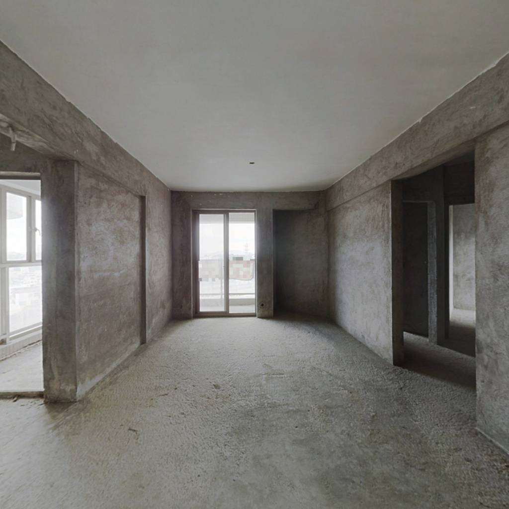
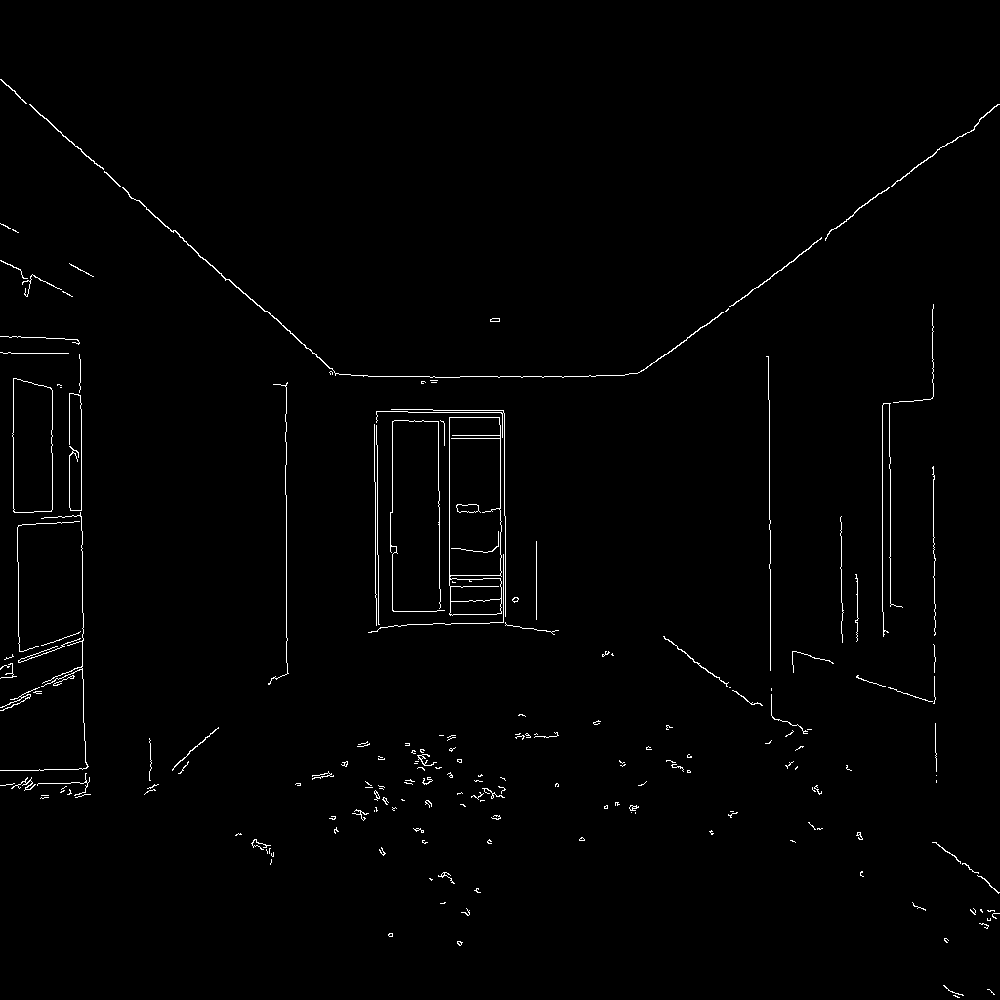
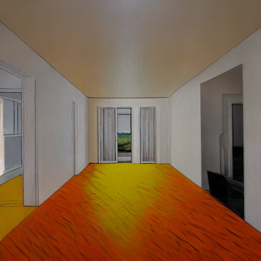

# openmmlab-learning

https://github.com/open-mmlab/OpenMMLabCamp/issues/396

# 代码

```
prompt = 'Room with white walls and a yellow ceiling and red desk.'

control_img = mmcv.imread("room.jpg")
control = cv2.Canny(control_img, 100, 200)
control = control[:, :, None]
control = np.concatenate([control] * 3, axis=2)
control = Image.fromarray(control)

output_dict = controlnet.infer(prompt, control=control)
samples = output_dict['samples']
for idx, sample in enumerate(samples):
    sample.save(f'sample_room_{idx}.png')
controls = output_dict['controls']
for idx, control in enumerate(controls):
    control.save(f'control_room_{idx}.png')
```


# 原始图片



# Canny 图片




# ControlNet 图片



